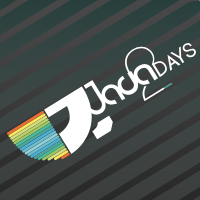

It's gotten to be a yearly event to visit Sofia in the early part of winter.  I'll be visiting again in a few weeks for the conference on the 18th and 19th of November.  The [Java2Days](http://www.java2days.com) conference is a mix of Java, Cloud and Mobile development talks and has always been a great time.  Between the wonderful hosts who organize the event, to the awesome attendees, it's definitely a conference to make time for every year.

Hope to see some of you there if you're anywhere near Bulgaria.  And if you're in Portugal over the next week, I'm there too.

Ciao!